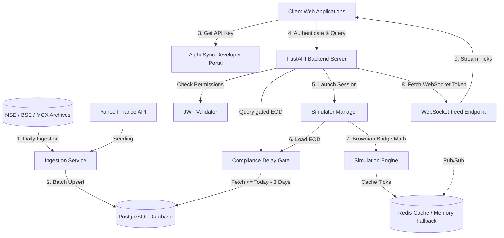

# AlphaSync Delayed-Data Layer - Technical Architecture

This document describes the technical architecture, database designs, security models, and design decisions of the **AlphaSync Dedicated Delayed-Data Layer** (`alphasync-data-layer`).

---

## 1. System Overview

The Data Layer is designed to comply with regulatory mandates (such as SEBI's educational data circular) by serving Indian stock market data under a strict rolling **3-day delay compliance gate**. 

It operates as a standalone service, acting as a proxy gateway. Consuming websites (like the AlphaSync portal frontend) call the REST APIs and establish WebSockets to this service using secure API client keys.

---

## 2. Database Schema

The database is built on **PostgreSQL** to handle historical end-of-day (EOD) data points, administrative keys, and audit logs. The models are defined in [models.py](app/db/models.py).

### A. `price_data` Table
Stores historical daily end-of-day stock OHLCV records for Equities, F&O derivatives, and Commodities.
*   `id` (Integer, Primary Key)
*   `symbol` (String, indexed) - e.g. `RELIANCE`
*   `exchange` (String) - `NSE`, `BSE`, or `MCX`
*   `segment` (String) - `EQ` (Cash Equities), `FUT` (Futures), or `OPT` (Options)
*   `expiry` (Date, nullable) - Contract expiration date (defaults to `1970-01-01` for equities)
*   `strike` (Numeric, nullable) - Strike price (defaults to `0.0` for equities)
*   `option_type` (String, nullable) - `CE`, `PE`, or `XX` (non-option)
*   `open_interest` (BigInteger, nullable) - Open interest count
*   `market_timestamp` (Date, indexed) - The trading day
*   `open`, `high`, `low`, `close` (Numeric) - Price values
*   `volume` (BigInteger) - Traded shares/contracts count
*   `ingested_at` (DateTime) - Audit timestamp
*   **Constraints**: Unique constraint on `(symbol, exchange, segment, expiry, strike, option_type, market_timestamp)` to prevent duplicate records.

### B. `api_keys` Table
Stores authorized developer client profiles and hashed secrets. Managed exclusively via the Admin Console (gated behind an admin login, `admin1`/`pass001` by default).
*   `id` (Integer, Primary Key)
*   `client_id` (String, Unique Index) - Public credentials identifier
*   `secret_hash` (String) - SHA-256 hash of the private secret key
*   `owner` (String) - Reference tag (e.g. `alphasync-website`)
*   `name` (String) - Optional human-readable label for the key
*   `scopes` (String Array) - Array of authorized scopes (e.g. `['nse:eq', 'nse:opt', 'admin']`)
*   `allowed_symbols` (String Array) - Optional symbol allowlist (`EXCHANGE:SEGMENT:SYMBOL`). Empty = all symbols within granted scopes.
*   `max_replay_speed` (Integer) - Maximum tick playback speed multiplier (1x-60x) this key may request for replay sessions
*   `rate_limit_per_min` (Integer) - API request limit
*   `is_active` (Boolean) - Derived from `status`; `False` when paused, disabled, or deleted
*   `status` (String) - One of `active`, `paused`, `disabled`, `deleted` (soft-delete; deleted keys are hidden but retained for audit)

### C. `ingestion_log` Table
Audits EOD bhavcopy ingestion cycles.
*   `id` (Integer, Primary Key)
*   `source` (String) - e.g. `nse_bhavcopy`
*   `target_date` (Date) - The ingested trading date
*   `status` (String) - `success`, `skipped`, or `failed`
*   `rows_ingested` (Integer) - Ingested row count
*   `error_message` (String, Nullable) - Details if failed

---

## 3. Compliance Delay Gate

The compliance gate is a centralized filter block in [delay_gate.py](app/core/delay_gate.py) that strictly enforces a rolling **3-day delay cutoff**.

### Design Decisions
1.  **Zone-aware boundaries**: The cutoff calculation converts the system clock into Indian Standard Time (IST / `Asia/Kolkata`) prior to calculating the rolling threshold, ensuring that timezone offsets cannot bypass the delay rules.
2.  **SQL Gating**: Rather than filtering records in Python memory, database operations strictly append a `market_timestamp <= cutoff` condition to queries, making it mathematically impossible to leak restricted datasets.
3.  **Automatic Clipping**: Multi-day historical charts are dynamically clipped. If a user queries dates between `start` and `end`, where `end` is inside the restricted 3-day window, the system adjusts the query boundary to the cutoff date.

---

## 4. Tick Simulation Engine

Since this is a delayed compliance gateway, the service does not connect to real-time live trading multicast sockets. Instead, it features a **real-time tick simulation engine** to recreate high-frequency market updates.

### Brownian Bridge Algorithm
The tick path simulator ([brownian_bridge.py](app/simulator/brownian_bridge.py)) takes a stock's historical EOD `open`, `high`, `low`, and `close` prices for a date, and generates a realistic 22,500-tick intraday path.
*   **Formula**:
    $$W_{bridge}(t) = W_t - \frac{t}{T} W_T + P_{start} + \frac{t}{T}(P_{end} - P_{start})$$
    where $W_t$ is standard Brownian motion (with scaling volatility).
*   **Guarantees**: The generated path starts exactly at `open`, ends exactly at `close`, and is strictly bounded by the `low` and `high` extremes.
*   **Volume distribution**: Volume is distributed using a quadratic, U-shaped intraday weight distribution curve to model higher market volumes at open and close.

### Performance Optimizations (20x Speedup)
To avoid standard Python overhead during batch generation, time strings (`HH:MM:SS`) for all 22,500 seconds are pre-calculated at module load time. Reusing this pre-calculated array reduces Python loop cycles, dropping single-stock simulation compilation times from **51.8ms** to **2.5ms**.

---

## 5. Session Management & WebSocket Streaming

WebSockets provide the low-latency channels needed to stream ticks to connected dashboards.

### Steps in the Stream Lifecycle
1.  **Session Creation**: The client calls `/v1/sessions` to spin up a virtual replay clock at a configured playback speed (1x to 60x).
2.  **Tick Pre-Caching**: The client subscribes to instruments. The simulator manager runs the Brownian Bridge engine and caches the full 22,500 tick paths in Redis (or in-memory cache fallbacks).
3.  **Feed Token Exchange**: Since WebSockets do not natively support standard authentication headers in many browser environments, clients execute a single-use exchange call (`POST /v1/auth/feed-token`) to obtain a short-lived `feed_token`.
4.  **WebSocket Handshake**: The browser connects to `ws://localhost:8000/v1/feed?token=<feed_token>`, which consumes the token and opens the WebSocket tunnel.
5.  **Broadcast Loop**: A background task advances the virtual clock according to the configured playback speed and broadcasts tick slices to active listeners using Redis Pub/Sub channels or local queue hooks.
