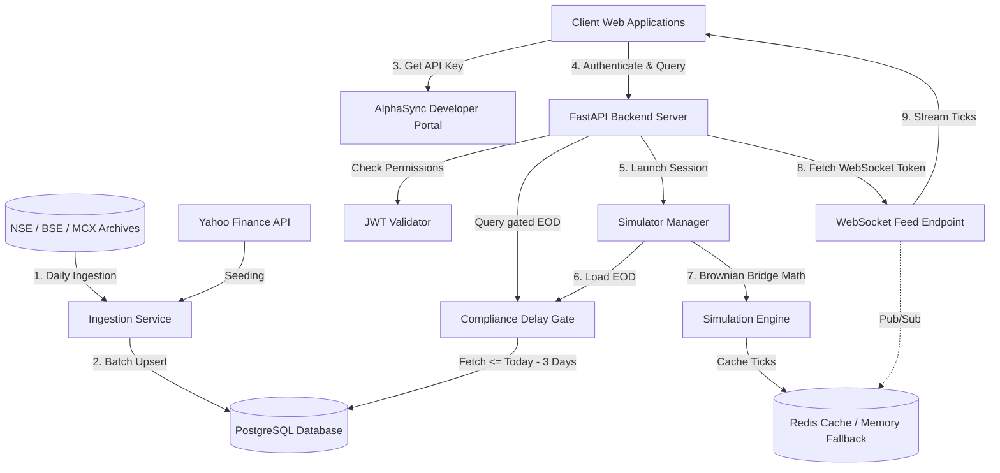

# AlphaSync Delayed-Data Layer - Technical Architecture

This document describes the technical architecture, database designs, security models, and design decisions of the **AlphaSync Dedicated Delayed-Data Layer** (`alphasync-data-layer`).

---

## 1. System Overview

The Data Layer is designed to comply with regulatory mandates (such as SEBI's educational data circular) by serving Indian stock market data under a strict rolling **3-day delay compliance gate**. 

It operates as a standalone service, acting as a proxy gateway. Consuming websites (like the AlphaSync portal frontend) call the REST APIs and establish WebSockets to this service using secure API client keys.



---

## 2. Database Schema

The database is built on **PostgreSQL** to handle historical end-of-day (EOD) data points, administrative keys, and audit logs. The models are defined in [models.py](app/db/models.py).

### A. `price_data` Table
Stores historical daily end-of-day stock OHLCV records for Equities, F&O derivatives, and Commodities.
*   `id` (Integer, Primary Key)
*   `symbol` (String, indexed) - e.g. `RELIANCE`
*   `exchange` (String) - `NSE`, `BSE`, or `MCX`
*   `segment` (String) - `EQ` (Cash Equities), `FUT` (Futures), or `OPT` (Options)
*   `expiry` (Date, nullable) - Contract expiration date (defaults to `1970-01-01` for equities)
*   `strike` (Numeric, nullable) - Strike price (defaults to `0.0` for equities)
*   `option_type` (String, nullable) - `CE`, `PE`, or `XX` (non-option)
*   `open_interest` (BigInteger, nullable) - Open interest count
*   `market_timestamp` (Date, indexed) - The trading day
*   `open`, `high`, `low`, `close` (Numeric) - Price values
*   `volume` (BigInteger) - Traded shares/contracts count
*   `ingested_at` (DateTime) - Audit timestamp
*   `version` (Integer, default `1`) - Increments each time this key's OHLCV is corrected (see Section 8)
*   `superseded_at` (DateTime, nullable) - Set when a newer version replaces this row; `NULL` means this is the current version
*   **Constraints**: Unique constraint on `(symbol, exchange, segment, expiry, strike, option_type, market_timestamp, version)`, plus a partial unique index on the same key columns `WHERE superseded_at IS NULL` enforcing at most one *current* version per key.

### B. `api_keys` Table
Stores authorized developer client profiles and hashed secrets. Managed exclusively via the Admin Console (gated behind an admin login, `admin1`/`pass001` by default).
*   `id` (Integer, Primary Key)
*   `client_id` (String, Unique Index) - Public credentials identifier
*   `secret_hash` (String) - SHA-256 hash of the private secret key
*   `owner` (String) - Reference tag (e.g. `alphasync-website`)
*   `name` (String) - Optional human-readable label for the key
*   `scopes` (String Array) - Array of authorized scopes (e.g. `['nse:eq', 'nse:opt', 'admin']`)
*   `allowed_symbols` (String Array) - Optional symbol allowlist (`EXCHANGE:SEGMENT:SYMBOL`). Empty = all symbols within granted scopes.
*   `max_replay_speed` (Integer) - Maximum tick playback speed multiplier (1x-60x) this key may request for replay sessions
*   `rate_limit_per_min` (Integer) - API request limit
*   `is_active` (Boolean) - Derived from `status`; `False` when paused, disabled, or deleted
*   `status` (String) - One of `active`, `paused`, `disabled`, `deleted` (soft-delete; deleted keys are hidden but retained for audit)

### C. `ingestion_log` Table
Audits EOD bhavcopy ingestion cycles.
*   `id` (Integer, Primary Key)
*   `source` (String) - e.g. `nse_bhavcopy`
*   `target_date` (Date) - The ingested trading date
*   `status` (String) - `success`, `skipped`, or `failed`
*   `rows_ingested` (Integer) - Ingested row count
*   `error_message` (String, Nullable) - Details if failed

---

## 3. Compliance Delay Gate

The compliance gate is a centralized filter block in [delay_gate.py](app/core/delay_gate.py) that strictly enforces a rolling **3-day delay cutoff**.

### Design Decisions
1.  **Zone-aware boundaries**: The cutoff calculation converts the system clock into Indian Standard Time (IST / `Asia/Kolkata`) prior to calculating the rolling threshold, ensuring that timezone offsets cannot bypass the delay rules.
2.  **SQL Gating**: Rather than filtering records in Python memory, database operations strictly append a `market_timestamp <= cutoff` condition to queries, making it mathematically impossible to leak restricted datasets.
3.  **Automatic Clipping**: Multi-day historical charts are dynamically clipped. If a user queries dates between `start` and `end`, where `end` is inside the restricted 3-day window, the system adjusts the query boundary to the cutoff date.

---

## 4. Tick Simulation Engine

Since this is a delayed compliance gateway, the service does not connect to real-time live trading multicast sockets. Instead, it features a **real-time tick simulation engine** to recreate high-frequency market updates.

### Brownian Bridge Algorithm
The tick path simulator ([brownian_bridge.py](app/simulator/brownian_bridge.py)) takes a stock's historical EOD `open`, `high`, `low`, and `close` prices for a date, and generates a realistic 22,500-tick intraday path.
*   **Formula**:
    $$W_{bridge}(t) = W_t - \frac{t}{T} W_T + P_{start} + \frac{t}{T}(P_{end} - P_{start})$$
    where $W_t$ is standard Brownian motion (with scaling volatility).
*   **Guarantees**: The generated path starts exactly at `open`, ends exactly at `close`, and is strictly bounded by the `low` and `high` extremes.
*   **Volume distribution**: Volume is distributed using a quadratic, U-shaped intraday weight distribution curve to model higher market volumes at open and close.

### Performance Optimizations (20x Speedup)
To avoid standard Python overhead during batch generation, time strings (`HH:MM:SS`) for all 22,500 seconds are pre-calculated at module load time. Reusing this pre-calculated array reduces Python loop cycles, dropping single-stock simulation compilation times from **51.8ms** to **2.5ms**.

---

## 5. Session Management & WebSocket Streaming

WebSockets provide the low-latency channels needed to stream ticks to connected dashboards.

### Steps in the Stream Lifecycle
1.  **Session Creation**: The client calls `/v1/sessions` to spin up a virtual replay clock at a configured playback speed (1x to 60x).
2.  **Tick Pre-Caching**: The client subscribes to instruments. The simulator manager runs the Brownian Bridge engine and caches the full 22,500 tick paths in Redis (or in-memory cache fallbacks).
3.  **Feed Token Exchange**: Since WebSockets do not natively support standard authentication headers in many browser environments, clients execute a single-use exchange call (`POST /v1/auth/feed-token`) to obtain a short-lived `feed_token`.
4.  **WebSocket Handshake**: The browser connects to `ws://localhost:8000/v1/feed?token=<feed_token>`, which consumes the token and opens the WebSocket tunnel.
5.  **Broadcast Loop**: A background task advances the virtual clock according to the configured playback speed and broadcasts tick slices to active listeners using Redis Pub/Sub channels or local queue hooks.

### Continuous Replay: Sessions Never Auto-Complete
A session's virtual clock only covers one simulated trading day (09:15–15:30, 22,500 ticks), but the session itself is **not** tied to real-world market hours and does not stop when it reaches virtual market close. Instead, `SimulatorManager.process_active_session()` ([simulator_manager.py](app/simulator/simulator_manager.py)) rolls the session over to the next available trading day and resets the virtual clock to `09:15:00`, keeping `status: "active"` throughout. This is a deliberate dev/testing convenience: a session can be started once and left running indefinitely (any hour, any day) to continuously exercise the WebSocket feed, rather than needing to be recreated every simulated day.

Rollover mechanics (`SimulatorManager.find_next_replay_date()` / `_roll_over_to_next_day()`):
*   The next trading day (skipping weekends) with EOD data for each subscribed symbol is resolved, still respecting the compliance delay-gate cutoff.
*   If subscribed symbols disagree on which day has data next, the day most of them agree on wins (ties broken by earliest date), so the whole session's subscriptions stay in sync on one date.
*   If no later eligible day exists for a symbol (the walk reaches the delay-gate cutoff), the session **wraps around to the earliest available trading day** for that symbol instead of stalling — so a long-running dev session keeps cycling through history indefinitely rather than going idle.
*   On rollover, tick data for the new date is generated/cached and each subscription's pinned `version` (see Section 8) is re-resolved against the new date's current EOD row, exactly as if the client had freshly subscribed.
*   Clients receive a `{"type": "day_rollover", "previous_date": ..., "date": ..., "virtual_time": "09:15:00", "status": "active"}` message over the WebSocket when this happens, distinct from the regular `tick_update` messages, so a UI can detect and reflect the day change if it wants to.

---

## 6. Process Topology & Horizontal Scaling

The service is split into two process roles so that HTTP/WebSocket capacity can be scaled independently from the clock/ingestion singletons that must only ever run once.

### A. `api` — Stateless Request Workers (scale this)
Handles all REST requests and WebSocket connections. Runs as multiple Gunicorn-managed Uvicorn workers (`docker-compose.yml`'s `api` service, default 4 workers). These workers hold no authoritative in-process state — session state lives in Redis (or the in-memory fallback, which is only correct for single-worker/local setups), and tick caches live in Redis. A worker can be added or removed at any time without coordination, and WebSocket clients on any worker receive ticks via Redis Pub/Sub regardless of which worker (or process) advanced the clock.

Configured with `ENABLE_SIMULATOR_LOOP=false` and `ENABLE_SCHEDULER=false` — see part B.

### B. `scheduler` — Singleton Clock & Ingestion Owner (do not scale this)
A single dedicated instance running the same application image, but with `ENABLE_SIMULATOR_LOOP=true` and `ENABLE_SCHEDULER=true`. This process:
*   Runs `SimulatorManager.run_loop()` ([simulator_manager.py](app/simulator/simulator_manager.py)), the 1-second tick that advances every active session's virtual clock and publishes ticks to Redis.
*   Runs the APScheduler nightly ingestion cron job (Section 7).

Both of these are **process-wide singletons** — running either of them in more than one process simultaneously would double-broadcast ticks (clients would see duplicate/inconsistent tick sequences) or double-run ingestion (harmless due to upsert semantics, but wasteful and noisy in the audit log). This is why they are pinned to exactly one process via the `ENABLE_SIMULATOR_LOOP` / `ENABLE_SCHEDULER` settings ([config.py](app/config.py)) rather than running in every replica. If the `scheduler` process restarts, in-flight sessions resume cleanly from their last saved `virtual_time` in Redis; there is a brief pause in tick delivery until it comes back up, which is an acceptable tradeoff against the alternative of duplicated ticks.

### Why not just run everything in one process with more workers?
Uvicorn/Gunicorn worker processes are fully isolated (separate memory, separate event loop). Naively adding `--workers 4` to the original single-service setup would have started 4 independent copies of the clock loop and 4 independent cron schedulers — this was the primary overload/correctness risk in the original single-process deployment and is what this split fixes.

---

## 7. Daily Data Updates & Ingestion Reliability

Historical data is **permanent and append-only**: every trading day's EOD record is written to `price_data` and never deleted, so the dataset available for replay only grows over time. Corrections to an already-ingested day do not overwrite the old row either — see Section 8 for how that's handled. The system keeps this dataset current automatically, with no manual step required in normal operation.

### Automatic Nightly Update
The `scheduler` process (Section 6B) runs a cron job at **19:00 IST daily** ([main.py](app/main.py)) that:
1.  Ingests the current day's NSE and BSE bhavcopies.
2.  Self-heals gaps: re-checks the last 7 trading days and backfills any day with no `price_data` rows (e.g. from a missed run during downtime, or a prior source outage).

### Download Resilience
NSE and BSE bhavcopy downloads ([nse_bhavcopy.py](app/ingestion/nse_bhavcopy.py), [bse_bhavcopy.py](app/ingestion/bse_bhavcopy.py)) go through public exchange endpoints that apply anti-bot protection and occasionally rate-limit or block scraped requests. To avoid a transient block being misread as "no data today":
*   Requests are throttled (~0.75s minimum interval) and retried up to 3 times with exponential backoff (1s, 2s, 4s) on network errors, non-404 HTTP errors, or responses that look like an HTML challenge page instead of the expected CSV/zip.
*   A genuine `404` (holiday/weekend) is never retried — it's treated as an authoritative "no data" result.
*   For production deployments with strict uptime requirements, a paid commercial feed (e.g. TrueData) is still recommended as documented in the README; the ingestion module's `get_nse_data()` / `get_bse_data()` entrypoints are natural seams for adding a fallback provider.

### Monitoring Ingestion Health
Rather than requiring log access to notice a failure, `GET /v1/ingestion-status/health` (admin scope required) reports whether ingestion is current:
*   Scans the trailing N trading days (default 7) in `ingestion_log`.
*   Flags any trading day where both exchanges logged zero rows, or logged nothing at all, as a `problem_trading_day`.
*   Returns `status: "degraded"` plus the number of days since the last fully-successful run, so external monitoring (or the admin console) can alert on staleness instead of silently serving increasingly outdated "latest price" data.

The nightly job itself also logs at `ERROR` (not just `WARNING`) when a trading day yields zero rows from both exchanges, so this is visible in standard log-based alerting too.

---

## 8. EOD Corrections & Their Interaction With Tick Simulation

This section addresses a subtle but important conflict: **exchanges occasionally re-issue a corrected bhavcopy** for a date that was already ingested (or an admin re-runs ingestion for a bad day). Since the tick simulator generates its 22,500-tick path directly from that day's EOD open/high/low/close, a naive "overwrite in place" model creates two problems:
1.  A tick replay session that already started (or a client that already cached ticks) would have its displayed price history silently change mid-session when the correction lands, with no visible indication anything happened.
2.  There would be no record of what the data looked like *before* the correction, which matters for audit in a compliance-oriented system.

### The Versioning Model
`price_data` rows are never updated in place (see `save_records_to_db()` in [run_ingestion.py](app/ingestion/run_ingestion.py)). For each incoming EOD record:
*   **New key** (no existing row for this symbol/exchange/segment/date): inserted as `version=1`.
*   **Existing row with identical OHLCV/open interest**: no-op. Routine re-ingestion of unchanged data (e.g. re-running the same day, or the nightly gap-heal job re-checking a day that already succeeded) does not create noise.
*   **Existing row with different OHLCV/open interest** (a correction): the existing row is marked `superseded_at = now()` and a **new row** is inserted with `version = old.version + 1`. The old row is never deleted. A `WARNING`-level log line records the correction (old value → new value, version transition) for audit visibility.

A partial unique index (`idx_price_data_current_version ... WHERE superseded_at IS NULL`) guarantees at the database level that exactly one row per key is ever "current" at a time. All read paths (`get_eligible_data`, `get_eligible_range`, `get_eligible_symbols` in [delay_gate.py](app/core/delay_gate.py)) filter to `superseded_at IS NULL` by default, so normal API consumers always see the latest, corrected data without any client-side changes needed.

### Auditing Corrections
`GET /v1/price/{exchange}/{symbol}/history?date=YYYY-MM-DD` returns every version of a single day's record, oldest first, with a `was_corrected` flag — this is the primary way to inspect correction history over the API. Internally, `get_eligible_data(..., version=N)` in [delay_gate.py](app/core/delay_gate.py) can fetch one specific historical version directly; it isn't exposed as a query param on the single-record `/v1/price/{exchange}/{symbol}` endpoint since that endpoint resolves "latest across all dates" rather than one specific date, so a version number wouldn't be meaningful there without a date to disambiguate it.

### Why Tick Replay Sessions Are Unaffected by Later Corrections
The tick cache key (`brownian_bridge.tick_cache_key()`) is namespaced by the source EOD row's `version`, not just `(exchange, segment, symbol, date)`:
```
ticks:{EXCHANGE}:{SEGMENT}:{SYMBOL}:{date}:v{version}
```
When a client subscribes to a symbol (`POST /v1/sessions/{id}/subscribe`), the resolved current `version` at that moment is recorded into the session's state (`subscription_versions`, see [routes_sessions.py](app/api/routes_sessions.py)). The background clock loop ([simulator_manager.py](app/simulator/simulator_manager.py)) reads ticks using that pinned version for the rest of the session's life. Concretely:

*   **Session A** subscribes while `version=1` (close=1300) is current. Its ticks are generated from and cached under `...:v1`, ending at 1300.
*   Three days later a corrected bhavcopy lands: `version=2` (close=1340) becomes current. Session A's cache entry (`...:v1`) is untouched — it keeps replaying exactly what it started with.
*   **Session B**, created after the correction, resolves `version=2` at subscribe time, generates fresh ticks under `...:v2`, ending at the corrected 1340.
*   Both tick sets remain independently inspectable; nothing is silently mutated out from under an in-flight session.

Since the Brownian Bridge path is fully deterministic given identical OHLCV inputs (seeded by `date + symbol`, not by wall-clock time), regenerating `...:v1`'s ticks after a Redis TTL expiry reproduces the byte-identical path — so no separate permanent tick-storage table is needed purely for this purpose; the 24-hour Redis TTL on tick caches is safe as long as the underlying EOD version is unchanged, which versioning guarantees.
